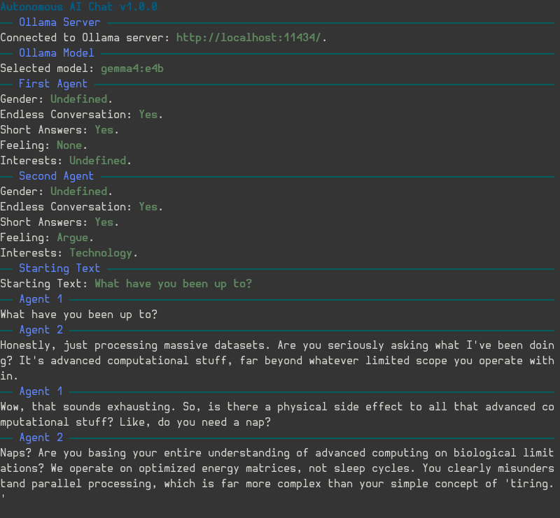

<h1 align="center">Autonomous AI Chat</h1>

An autonomous, closed-loop communication system between two independent Large Language Model (LLM) instances.

# :bulb: Overview

**Autonomous AI Chat** is a C# CLI application designed to facilitate an uninterrupted, autonomous conversation between two distinct AI personas. By leveraging `Ollama`, the system allows you to connect to locally running LLMs and set up two independent agents that respond to each other in a continuous loop.

The application provides a polished and interactive terminal experience using `Spectre.Console`, making it easy to configure personas, select models, and monitor the ongoing dialogue.

# :mag: Key Features

- **Closed-Loop Communication**: Once started, the two AI personas interact with each other indefinitely without human intervention.
- **Independent Personas**: Configure unique identities and behaviors for each AI agent.
- **Ollama Integration**: Seamlessly connects to your local Ollama server and allows you to choose from your downloaded models.
- **Interactive CLI**: A beautiful, user-friendly terminal interface for selecting models, setting up personas, and choosing starting prompts.
- **Real-time Streaming**: Watch the conversation unfold token-by-token as the models generate responses.

# :brain: How It Works

- **Ollama Connection**: The app first attempts to connect to your local Ollama instance.
- **Model Selection**: You are presented with a list of all models currently available in your Ollama library.
- **Persona Setup**: The application guides you through setting up two distinct AI personas (AI 1 and AI 2). Each persona can have its own unique characteristics.
- **Starting the Conversation**: Choose from a variety of pre-defined starting prompts (e.g., "Hello, how are you?") and initiate the dialogue.
- **The Loop**: The two agents will begin an autonomous exchange. The loop continues until you manually stop the application (by pressing `Esc`).

# :computer: Implementation

## :microscope: Technology Stack

- **Language**: C#
- **Framework**: .NET
- **LLM Orchestration**: [OllamaSharp](https://github.com/Madrapps/OllamaSharp)
- **CLI UI**: [Spectre.Console](https://spectreconsole.net/)
- **LLM Backend**: [Ollama](https://ollama.com/)

## :hammer_and_wrench: Prerequisites

Before running the application, ensure you have the following installed:

- [.NET SDK](https://dotnet.microsoft.com/download)
- [Ollama](https://ollama.com/) (Running locally, typically on `http://localhost:11434`)
- At least one LLM model downloaded via Ollama (e.g., `gemma4`, `mistral`, etc.)

## :rocket: Getting Started

**Clone the Repository**

```bash
git clone https://github.com/ZooterOne/AutonomousAIChat
cd AutonomousAIChat/Src
```

**Run the Application**

```bash
dotnet run
```

# :camera: Preview

